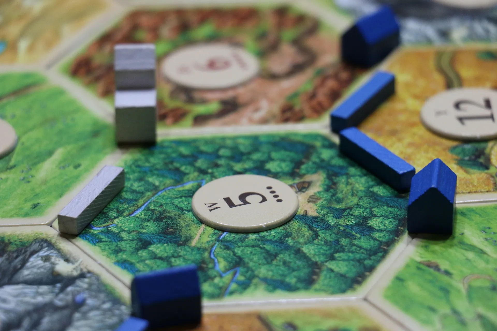
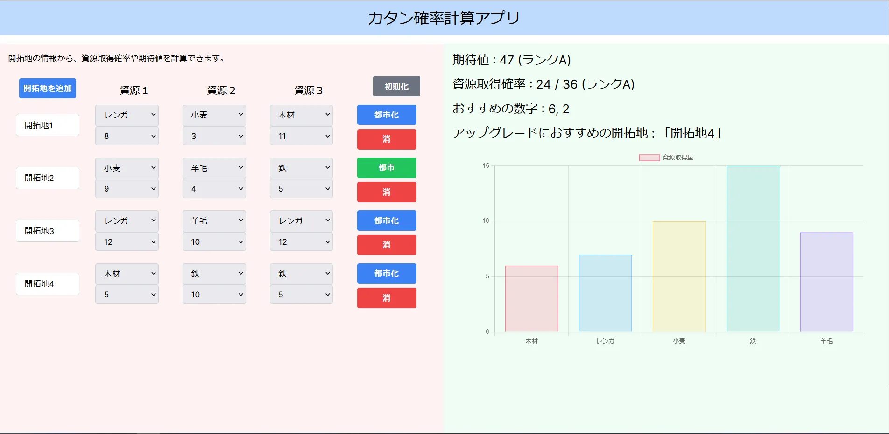

# カタン確率計算アプリ

## 概要

「カタン確率計算アプリ」は、ボードゲーム「カタン」を遊ぶ際に、開拓地の情報から資源の取得確率と期待値を計算するツールです。

## デモ

以下のように動作します。

## 説明

画面左半分に開拓地の情報を入力します。tab 移動と矢印をうまく使うと素早く入力できておすすめです。

「開拓地を追加」：新たな開拓地を追加します。開拓地の名前は自動的に「開拓地ｎ」(nは自然数)になります。  
「都市化」：開拓地を都市にアップグレードします。  
「消」：開拓地を削除します。  
「初期化」：すべての情報を初期化します。  

また開拓地の名前は変更することができます。  
 
画面右半分には入力された情報を元に、確率や期待値などが表示されます。  
「期待値」：６面ダイス２つの和の組み合わせ、３６通りがすべて出たときもらえる資源の量を表示します。  
「資源取得確率」：ダイスを振ったとき、資源が１枚以上もらえる確率を表示します。  
「おすすめの数字」：まだ開拓地をおいていない数字の中で価値の高いもの上位３つをおすすめとして表示します。  
「アップグレードにおすすめの開拓地」：数字から計算して最も期待値が大きくなる開拓地をおすすめとして表示します。  
